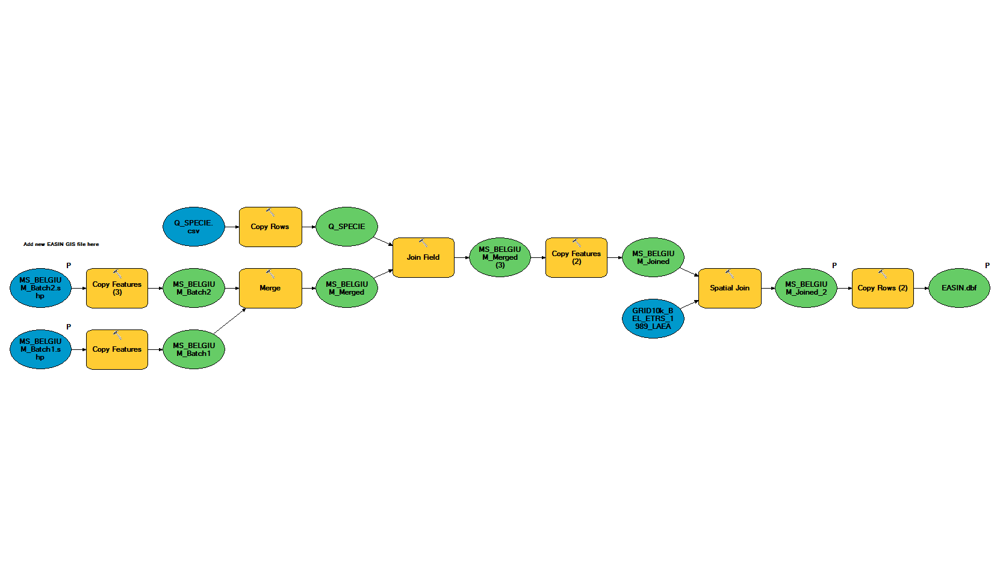

# EASIN Workflow
## Rationale
To create an update to the memberstate T0 layer provided by EASIN (MS_BELGIUM.shp) using the data aggregated by the memberstate in their [aggregated dataset](https://github.com/inbo/invasive-t0-occurrences). The update is provided by stating, in the column Accepted,  whether the squares provided by EASIN are correct (Y) or incorrect (N). New squares, those missing from the EASIN - Layer, should also be added with the value "New" in the Accepted column. 

Since most of the squares in belgium would be "New", experts decided it would be easier to provide EASIN with a new layer, in a similar format, for EASIN to subsitute its layer with.  

## Scripts
### [Update Source](https://github.com/SanderDevisscher/EASIN/blob/master/r-scripts/Update%20Source.R) 
   * Downloads [aggregated dataset](https://github.com/inbo/invasive-t0-occurrences) from github. 
     * _!Currently we're unable to download the .zip file from the T0 - dataset using R! Therefor the .zip should be downloaded manually into the private folder. The "Update Source" script will then unzip the .zip for further use._
     * _!Additionally due to the short time frame for the 2nd batch update, new datasets will be merged with the existing T0 dataset using the [SMARTIE-tool.](https://github.com/inbo/invasive-t0-occurrences/tree/smartie) 
     
Input | Output
-------|-------
[aggregated dataset](https://github.com/inbo/invasive-t0-occurrences) | ./Output/T0_SourceData_dd_mm_yy.csv
------ | [Iteration.gsheet](https://docs.google.com/spreadsheets/d/1kCENS0MpmjJXZEPdpxJB4XRaSS2ms63w8UqSA79Dh0c/edit#gid=1088427352) (=> Log)
    
### [subset data](https://github.com/SanderDevisscher/EASIN/blob/master/r-scripts/subset%20data.R) 
  * Subsets data from output of Update Source script
    * Only Listed species
    * Only records with at least Grid10k cellcode (added in aggregation process, no cellcode means record with incorrect spatial reference)
    * Only records from:
    
    Batch | Tn | Startdate | Enddate
     -----|-----|-----------|--------
    1st | 0 | 01/01/2000 | 31/01/2016 
    2nd | 0 | 01/01/2000 | 31/08/2017
    
    * Only records with correct validationstatus
    * Certain more common and recognisable species are non-propotionally not treated, under treatment or not treatable. Experts selected the following species to have all validation statuses included.
      * 1st batch
        * Threskiornis aethiopicus (Latham, 1790) 
        * Oxyura jamaicensis (Gmelin, 1789)
        * Procyon lotor (Linnaeus, 1758)
        * Cabomba caroliniana A. Gray
        * Tamias sibiricus (Laxmann, 1769)
        * Nasua nasua (Linnaeus, 1766)
        * Eriocheir sinensis H. Milne Edwards, 1853
        * Pseudorasbora parva (Temminck & Schlegel, 1846)
        * Trachemys Agassiz, 1857
      * 2nd batch (to be reviewed by experts)
        * Alopochen aegypticus

Input | Output
-------|-------

#### <I> Dataexploration (Optional) </I>

#### [Replacement EASIN.accdb](https://github.com/SanderDevisscher/EASIN/blob/master/r-scripts/Replacement%20EASIN.accdb.rmd)

Replacement of the EASIN.accdb as described in [issue #2](https://github.com/SanderDevisscher/EASIN/issues/2) and under **MS Access**

Input | Output
-------|-------

#### [Create Q_Specie](https://github.com/SanderDevisscher/EASIN/blob/master/r-scripts/Create%20Q_SPECIE.Rmd) 

Input | Output
-------|-------

## Arcgis part I

*The tools to use in the post-script analysis can be found in the T0_Toolbox.tbx on AWS/citrix.
filepath: Q:\Projects\PRJ_Faunabeheer\INBOPRJ-10217 - Monitoring exoten ikv EU- verordening IAS  Coördinatie, voorbereiding, implementatie en opvolging\T0_Toolbox.tbx*

* Stap 1 GRID10k Link
* Stap 2 GRID10k Merge (2)
* Stap 3 Dissolve
* Stap 4 GRID10k EASIN and T0 Link (2)
* Stap 5 MS_Belgium_Check (2)
* Extra MS_Belgium_CorrectNames => Changes species names from the EASIN baselayer with correct names and Outputs EASIN.dbf & MS_BELGIUM_Joined2
* Extra Project UTM Layers => Projects the UTM1x1 and GRID10k layers to ETRS_1989_LAEA. 
  * Output: GRID10k_BEL_ETRS_1989_LAEA

Extra's should be run when new layers are provided by EASIN or when in a rare case other projections are needed.

#### Extra: MS Belgium CorrectNames

Matches the shape provided by EASIN with the names used for the GIS models

Input | Output
-------|-------
\\Client\G$\Mijn Drive\INBOPRJ-10217 - Monitoring exoten ikv EU- verordening IAS  Coördinatie, voorbereiding, implementatie en opvolging\EASIN\Data\EASIN files\ **MS_BELGIUM_BatchX.shp** *(a shape provided by EASIN containing the presence data for the xth batch of species as present in EASIN. Everytime a new shape is provided the new shape has to be added to the model. all actions preformed on the other shapes should also be performed on the new one.)*| Q:\Projects\PRJ_Faunabeheer\INBOPRJ-10217 - Monitoring exoten ikv EU- verordening IAS  Coördinatie, voorbereiding, implementatie en opvolging\EASIN_GIS\EASIN_temp.gdb\ **MS_BELGIUM_Joined_2**
\\Client\G$\Mijn Drive\INBOPRJ-10217 - Monitoring exoten ikv EU- verordening IAS  Coördinatie, voorbereiding, implementatie en opvolging\EASIN\Data\EASIN files\ **Q_SPECIE.csv** | Q:\Projects\PRJ_Faunabeheer\INBOPRJ-10217 - Monitoring exoten ikv EU- verordening IAS  Coördinatie, voorbereiding, implementatie en opvolging\EASIN_GIS\AWS Output\ **EASIN.dbf**
Q:\Projects\PRJ_Faunabeheer\INBOPRJ-10217 - Monitoring exoten ikv EU- verordening IAS  Coördinatie, voorbereiding, implementatie en opvolging\EASIN_GIS\EASIN_temp.gdb\ **GRID10k_BEL_ETRS_1989_LAEA** | .

#### Stap 1 GRID10k Link

Iterates through the species (*%Value%*) in the script output (default: GRID10kData_Source_dd_mm_yy_Export_dd_mm_yy.dbf) and links it with the GRID10k layer

Prior to iteration species names had to be simplified (substitute all; .,"" ,() ,..., etc... with _) 

Input | Output
-------|-------
Q:\Projects\PRJ_Faunabeheer\INBOPRJ-10217 - Monitoring exoten ikv EU- verordening IAS  Coördinatie, voorbereiding, implementatie en opvolging\EASIN_GIS\Input\ **GRID10kData_Source_dd_mm_yy_Export_dd_mm_yy.dbf** | Q:\Projects\PRJ_Faunabeheer\INBOPRJ-10217 - Monitoring exoten ikv EU- verordening IAS  Coördinatie, voorbereiding, implementatie en opvolging\EASIN_GIS\EASIN_temp.gdb\ **GRID10k_Linked_%Value%**
Q:\Projects\PRJ_Faunabeheer\INBOPRJ-10217 - Monitoring exoten ikv EU- verordening IAS  Coördinatie, voorbereiding, implementatie en opvolging\EASIN_GIS\EASIN_temp.gdb\ **GRID10k_BEL_ETRS_1989_LAEA** | Q:\Projects\PRJ_Faunabeheer\INBOPRJ-10217 - Monitoring exoten ikv EU- verordening IAS  Coördinatie, voorbereiding, implementatie en opvolging\EASIN_GIS\EASIN_temp.gdb\ **STAT_GRID10k_Linked_%Value%**
. | Q:\Projects\PRJ_Faunabeheer\INBOPRJ-10217 - Monitoring exoten ikv EU- verordening IAS  Coördinatie, voorbereiding, implementatie en opvolging\EASIN_GIS\temp\ **GRID10k_Linked_%Value%.shp**

#### EXTRA: Empty GRID_Linked_ALL

Creates an empty feature class for outputs from Stap 1 to be appended in. 

Input | Output
-------|-------
Q:\Projects\PRJ_Faunabeheer\INBOPRJ-10217 - Monitoring exoten ikv EU- verordening IAS  Coördinatie, voorbereiding, implementatie en opvolging\EASIN_GIS\temp\ **GRID10k_Linked_%Value%.shp** (Any non - empty GRID10k_Linked shape) | Q:\Projects\PRJ_Faunabeheer\INBOPRJ-10217 - Monitoring exoten ikv EU- verordening IAS  Coördinatie, voorbereiding, implementatie en opvolging\EASIN_GIS\EASIN_temp.gdb\ **GRID_Linked_ALL**

#### Stap 2 GRID10k Merge (2)

  
Merges the outputs of Stap 1 into a geodatabase file named GRID10k_Linked_ALL and a dbf file (GRID_ALL.dbf). This last file is used in the EASIN.accdb to link with the output from the `Extra MS_Belgium_CorrectNames`model (EASIN.dbf). 

Input | Output
-------|-------
Q:\Projects\PRJ_Faunabeheer\INBOPRJ-10217 - Monitoring exoten ikv EU- verordening IAS  Coördinatie, voorbereiding, implementatie en opvolging\EASIN_GIS\temp\ **GRID10k_Linked_%Value%.shp** (Iterates through all GRID* polygon shapes in temp folder) | Q:\Projects\PRJ_Faunabeheer\INBOPRJ-10217 - Monitoring exoten ikv EU- verordening IAS  Coördinatie, voorbereiding, implementatie en opvolging\EASIN_GIS\EASIN_temp.gdb\ **GRID_Linked_ALL**
Q:\Projects\PRJ_Faunabeheer\INBOPRJ-10217 - Monitoring exoten ikv EU- verordening IAS  Coördinatie, voorbereiding, implementatie en opvolging\EASIN_GIS\EASIN_temp.gdb\ **GRID_Linked_ALL** (Empty feature class as result from EXTRA: Empty GRID_Linked_ALL) | Q:\Projects\PRJ_Faunabeheer\INBOPRJ-10217 - Monitoring exoten ikv EU- verordening IAS  Coördinatie, voorbereiding, implementatie en opvolging\EASIN_GIS\AWS Output\ **GRID_ALL.dbf **

## MS Access 
Using the outputs from Extra MS_Belgium_CorrectNames and Stap 2 GRID10k Merge (2) 

<I> The MS Access part of the analysis has been transformed into R - script named [Replacement EASIN.accdb.rmd](https://github.com/SanderDevisscher/EASIN/blob/master/r-scripts/Replacement%20EASIN.accdb.rmd) </I>
<I> see [issue #2](https://github.com/SanderDevisscher/EASIN/issues/2) </I>

Input | Output
-------|-------
 | 

## Arcgis part II

###

